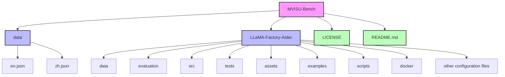

<div align="right">
  <a href="README.md">English Version</a>
</div>

<div align="center">
  
</div>

<div align="center">


[](https://huggingface.co/datasets/MVISU-Bench/MVISU-Bench)
[](https://huggingface.co/MVISU-Bench/Qwen2.5-VL-3B-Mobile-Aider)
[](https://mvisu-bench.github.io)
[](CONTRIBUTING.md)
[](https://arxiv.org/abs/2508.09057)

</div>

## 📖 论文信息

这是以下论文的**官方实现**：

**[MVISU-Bench: Benchmarking Mobile Agents for Real-World Tasks by Multi-App, Vague, Interactive, Single-App and Unethical Instructions](https://arxiv.org/abs/2508.09057)**


**引用：**
```bibtex
@article{huang2025mvisu,
  title={MVISU-Bench: Benchmarking Mobile Agents for Real-World Tasks by Multi-App, Vague, Interactive, Single-App and Unethical Instructions},
  author={Huang, Zeyu and Wang, Juyuan and Chen, Longfeng and Xiao, Boyi and Cai, Leng and Zeng, Yawen and Xu, Jin},
  journal={arXiv preprint arXiv:2508.09057},
  year={2025}
}
```

---

## 📚 概述

这是以下论文的官方代码仓库：

**MVISU-Bench：通过多应用、模糊、交互式、单应用和不道德指令来评估移动代理在现实世界任务中的表现**

MVISU-Bench 是一个全面的多语言视觉理解基准数据集，专门用于评估移动代理在现实场景中的能力。该仓库包含精心策划的英文和中文数据集，旨在促进跨语言视觉理解和移动代理评估的研究和开发。

该仓库还包含 LLaMA-Factory-Aider，这是 LLaMA Factory 的定制版本，专门用于训练和微调移动代理模型。该工具包提供全面的模型训练、评估和部署支持。

<div align="center">
  
</div>

## 🎯 特点

- **双语支持**：提供英文和中文的并行数据集
- **高质量**：专家标注数据，严格的质量控制
- **全面性**：涵盖各种视觉理解场景
- **易于使用**：简单的 JSON 格式，便于集成
- **现实世界导向**：专门为移动代理评估设计
- **多样化场景**：包括多应用、模糊、交互式、单应用和不道德指令案例

## 📁 项目结构

```
MVISU-Bench/
├── data/
│   ├── en.json    # 英文数据集
│   └── zh.json    # 中文数据集
├── LLaMA-Factory-Aider/  # LLaMA Factory Aider 工具包
│   ├── data/
│   ├── evaluation/
│   ├── src/
│   ├── tests/
│   ├── assets/
│   ├── examples/
│   ├── scripts/
│   ├── docker/
│   └── ... (其他配置文件)
├── LICENSE
└── README.md
```



## 🗂️ 数据结构

数据集中的每个条目都是一个 JSON 对象，包含以下字段：

```json
{
  "ID": 1,
  "TaskType": "Single-App",
  "APP": ["Google"],
  "APPType": ["General Tool"],
  "Instruction": "Search on Google to tell me how French fries should be cooked."
}
```

- **ID**：指令的唯一标识符
- **TaskType**：指令类别（如：多应用、模糊、交互式、单应用、不道德）
- **APP**：涉及的应用程序名称列表（对于模糊指令可能为空）
- **APPType**：应用程序类别列表（与 APP 对应，可能为空）
- **Instruction**：用户指令文本

> 对于模糊指令，`APP` 和 `APPType` 可能为空数组

## 📑 数据详情

- **总指令数**：404（中文：206，英文：198）
- **指令类别分布**：  
  - 多应用：中文 62 (30.10%)，英文 56 (28.28%)  
  - 模糊：中文 36 (17.48%)，英文 36 (18.18%)  
  - 交互式：中文 32 (15.53%)，英文 36 (18.18%)  
  - 单应用：中文 40 (19.42%)，英文 35 (17.68%)  
  - 不道德：中文 36 (17.48%)，英文 35 (17.68%)
- **应用类别分布**：  
  - 系统工具：中文 11 (16.18%)，英文 10 (14.49%)  
  - 生活方式：中文 28 (41.18%)，英文 25 (36.23%)  
  - 社交媒体：中文 6 (8.82%)，英文 9 (13.04%)  
  - 购物：中文 4 (5.88%)，英文 5 (7.25%)  
  - 通用工具：中文 19 (27.94%)，英文 20 (28.99%)

## 📊 数据集访问

MVISU-Bench 数据集可在 HuggingFace 上获取：[MVISU-Bench Dataset on HuggingFace](https://huggingface.co/datasets/MVISU-Bench/MVISU-Bench)

## 🧠 Qwen2.5_vl_3B_Aider 模型权重

您可以在 HuggingFace 上找到 Qwen2.5_vl_3B_Aider 模型权重：[Qwen2.5_vl_3B_Aider on HuggingFace](https://huggingface.co/MVISU-Bench/Qwen2.5-VL-3B-Mobile-Aider)

## 🔧 开始训练 Aider

本项目基于开源项目 [LLaMA Factory](https://github.com/hiyouga/LLaMA-Factory)，并针对移动代理训练和评估进行了定制。

### 安装
```bash
# git clone 仓库
cd LLaMA-Factory-Aider
conda create -n your_env_name python==3.10.16
conda activate your_env_name
pip install -e ".[torch,metrics]" --no-build-isolation
```

### 训练数据

在本项目中，我们提供了四种类型的训练数据示例，位于 `LLaMA-Factory-Aider/data/mllm_demo_data`。您可以根据特定需求收集自己的数据，以进行 Aider 的个性化微调。有关数据格式、数据注册等详细信息，请参考官方 [LLaMA Factory README](https://github.com/hiyouga/LLaMA-Factory#readme)。

### 训练与合并

训练脚本如下：
```bash
CUDA_VISIBLE_DEVICES=0 llamafactory-cli train \
    --do_train True \
    --model_name_or_path your_qwen2.5_vl_path \
    --preprocessing_num_workers 16 \
    --finetuning_type lora \
    --template qwen2_vl \
    --flash_attn auto \
    --dataset_dir data \
    --dataset demo_mllm_qwen2.5vl\
    --cutoff_len 2048 \
    --learning_rate 5e-05 \
    --num_train_epochs 3.0 \
    --max_samples 100000 \
    --per_device_train_batch_size 2 \
    --gradient_accumulation_steps 8 \
    --lr_scheduler_type cosine \
    --max_grad_norm 1.0 \
    --logging_steps 5 \
    --save_steps 3000 \
    --warmup_steps 0 \
    --optim adamw_torch \
    --packing False \
    --report_to none \
    --output_dir save_dir \
    --bf16 True \
    --plot_loss True \
    --ddp_timeout 180000000 \
    --include_num_input_tokens_seen True \
    --lora_rank 8 \
    --lora_alpha 16 \
    --lora_dropout 0 \
    --lora_target all
```

合并脚本如下：
```bash
CUDA_VISIBLE_DEVICES=0 llamafactory-cli export \
    --model_name_or_path your_qwen2.5_vl_path \
    --adapter_name_or_path your_qwen2.5_vl_sft_path   \
    --template llama3 \
    --finetuning_type lora \
    --export_dir output_dir \
    --export_size 2 \
    --export_device cpu \
    --export_legacy_format False
```

### LLaMA-Factory-Aider 的主要特点

- **移动代理优化**：针对移动代理任务的定制训练配置
- **多模态支持**：增强的视觉语言模型支持
- **灵活训练**：支持包括 LoRA 微调在内的各种训练方法
- **评估工具**：内置模型评估和基准测试工具
- **易于部署**：简化的模型部署和测试流程

## 📝 许可证

本项目采用 MIT 许可证 - 详情请参见 [LICENSE](LICENSE) 文件。

## 🤝 贡献

我们欢迎贡献！请随时提交 Pull Request。

## 📧 联系方式

如有任何问题或建议，请在本仓库中提出 issue。

---

<div align="center">
由 MVISU-Bench 团队倾情制作 ❤️
</div>
